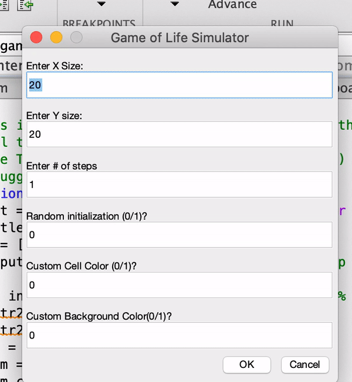

# Conways Game of Life in Matlab

This is a matlab simulation of Conway's game of life!

## Rules 

The board starts with a series of cells. Then at each step the following rules apply:

If a living cell has 2 or 3 neighbors, it continue to the next generation. 

If a living cell has less than 2 neighbors it dies through underpopulation 

If a living cell has more than 3 neighbors it dies of overcrowding

If a non-living space that has exactly 3 neighbors will spawn into a living cell

## How to run

To use this simulator run the file "interface.m" which will pull up an interface to begin running the game of life. 

## How to use the simulator

After entering the dimensions of the board as well as any customizations, you will be shown the visualization. These are the following things you can do during the visualization: 

To perform the next series of steps press 's'. 

To add/remove living cells click on the cell you'd like to perform the operation on. 

To add/remove a block of cells right click on one spot, then right click on the other spot and the entire block will be added/removed. Left click will abort this operation. 

To clear the entire board press 'c'. 

To quit the simulation press 'q'.

## Demo

